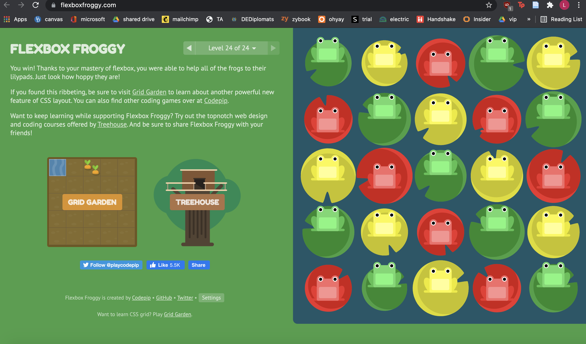

# About Me
TA for lab section 20
lbaron@udel.edu
source code [here](https://github.com/laurenbaron/laurenbaron.github.io)

# Portfolio
## Provided Tutorials
### Flexbox Froggy
I have very minimal front end experience (HTML, CSS, and Javscript); the most CSS I've done before this was copy and paste code from Bootstrap and tweak to my liking. This exercise showed me how to use CSS properties like justify-content, align-items, flex-direction, order, align-self, flex-wrap, flex-flow, and align-content. This will help me format, layout, and style my pages. 
